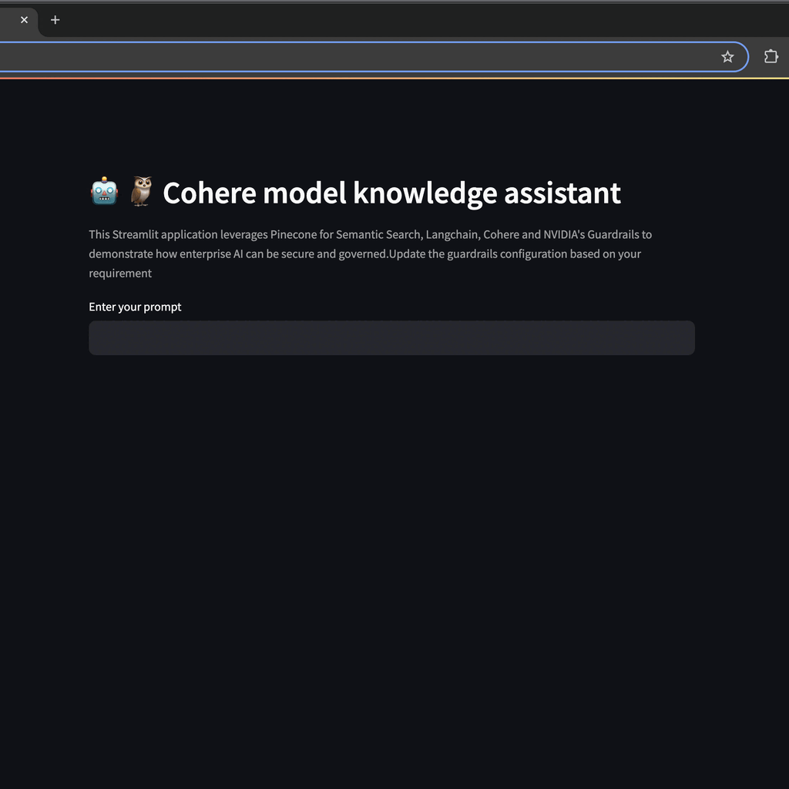

# AI Chatbot with Guardrails

This project implements an AI chatbot using Streamlit, leveraging Pinecone for Semantic Search, Langchain, Cohere, and NVIDIA's Guardrails to demonstrate secure and governed enterprise AI capabilities.

## Features

- Semantic search using Pinecone
- Language model integration with Cohere
- Guardrails implementation using NVIDIA NeMo Guardrails
- Asynchronous processing for improved performance
- Streamlit-based user interface

## Prerequisites

- Python 3.7+
- Streamlit
- Langchain
- Cohere API key
- Pinecone API key
- NVIDIA NeMo Guardrails

## Installation

1. Clone the repository:
   ```bash
   git clone https://github.com/yourusername/ai-chatbot-with-guardrails.git
   cd ai-chatbot-with-guardrails

## Installation

2. Install the required packages:
   ```bash
   pip install -r requirements.txt
   
3. Set up your environment variables:
   - `COHERE_API_KEY`
   - `PINECONE_API_KEY`
   - `PINECONE_INDEX`

## Usage

1. Run the Streamlit app:

   ```bash
   streamlit run app.py

2. Open your web browser and navigate to the provided local URL (usually http://localhost:8501).
3. Enter your prompt in the text input field and receive AI-generated responses with implemented guardrails.

## Configuration

- Modify the `rails.config` file to adjust the colang content for guardrails.
- Update the `config.yml` file to configure the YAML content for the application.

## How It Works

1. The application initializes by setting up connections to Cohere and Pinecone, and configuring the NeMo Guardrails.
2. User input is processed through a RAG (Retrieval-Augmented Generation) chain:
   - Relevant documents are retrieved from Pinecone based on the input.
   - A prompt is generated using the retrieved context and user question.
   - The prompt is passed through the guardrails system.
   - The language model generates a response.
3. The response is displayed to the user in the Streamlit interface.

<h3> Demo </h3>


## Contributing

Contributions are welcome! Please feel free to submit a Pull Request.

## License

This project is licensed under the MIT License - see the [LICENSE](LICENSE) file for details.
# cohere-demo
